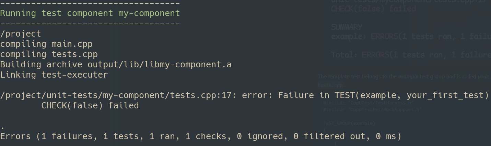

# Run your First Test

These instructions assume you have already [installed Flubber](../readme.md#Installation).
All commands are run from your project's root directory.

1. Create a new component.
    ````
    flubber/scripts/main.sh new-component --name=my-component
    ````

    This will create a directory `unit-tests/my-component` with the minimum files
    required to write and run tests.

    This script also creates the `unit-tests/mocks/source` and `unit-tests/mocks/include`
    directories if they do not exist, and a file called *forced_include.hpp* which
    is included in all test code.

2. Run the tests for the new component.
   ````
   flubber/scripts/main.sh run --components=my-component
   ````
    You should see the following output in your terminal:

    

The template test belongs to the *example* test group and is called *your_first_test*.
The test code is in the file `unit-tests/my-component/tests.cpp`.

```cpp
#include "CppUTest/TestHarness.h"
#include "CppUTestExt/MockSupport.h"

TEST_GROUP(example)
{
    void setup()
    {
    }

    void teardown()
    {
    }
};

TEST(example, your_first_test)
{
    CHECK(false);
}
```

For a more detailed explanation see [Test Components](./test-components.md).
