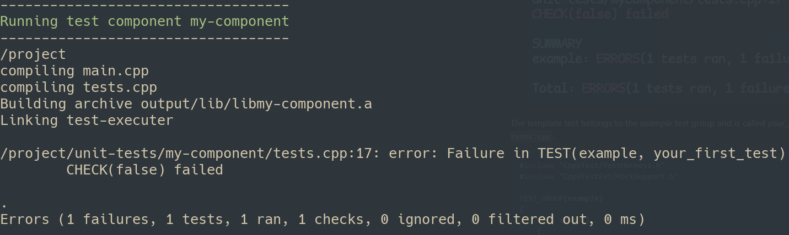

# Flubber

Provides a framework to write, run and pretty print unit tests using
[CppUTest](https://cpputest.github.io/).


## Run your first test

Add the unit test submodule to your project's root directory
````
git submodule add git@gitlab.local:davidmc/unit-test-executor.git
````

Navigate into the unit-test-executor directory
````
cd unit-test-executor
````

Checkout the latest tagged version of the unit-test-executor
````
git checkout <latest-tag>
````

Build the Docker image
```
docker build -t unit-tests -f Dockerfile .
```

Return to your project's root directory
```
cd ..
```

Create a new component
````
scripts/main.sh new-component --name=myComponent
````

This will create a directory *unit-tests/myComponent* with the minimum files
required to write and run tests.

This script also creates the *unit-tests/mocks/source* and *unit-tests/mocks/include*
directories if they do not exist, and a file called *forced_include.hpp* which
is included in all test code.

Run the tests for the new component
````
scripts/main.sh run --components=myComponent
````

You should see the following output in your terminal.



The template test belongs to the *example* test group and is called *your_first_test*.
The test code is in the file *unit-tests/myComponent/tests.cpp*.

## How does it work?

Unit tests are run as components.
Each component has its own directory in the *unit-tests/* folder.
The directory must contain a *main.cpp* file with the following contents:
```
#include "CppUTest/CommandLineTestRunner.h"

int main(int ac, char ** av)
{
    return CommandLineTestRunner::RunAllTests(ac, av);
}
````

*main.cpp* is the program entry point for each test component.

In addition to *main.cpp*, a file *Makefile* must be in the test component's
directory.
*Makefile* defines the include paths and source files for the component under
test.
At a minimum *Makefile* must include a *COMPONENT_NAME* variable whose value must
match the name of the test component's directory,  the line *include ../../unit-test-executor/cpputest-config*, and call CppuTest's *MakeFileWorker*.


An example __Makefile__ is shown below.
```
# Name of component under test - required
COMPONENT_NAME = myComponent

# cpputest configuration - required
include ../../unit-test-executor/cpputest-config

# Includes (.hpp) for this component
# The += is important!
INCLUDE_DIRS += \
$(PROJECT_DIR)/include/ \
$(PROJECT_DIR)/unit-tests/mocks/include/ \

# Source files (.cpp) for this component
SRC_FILES = \
$(PROJECT_DIR)/source/main.cpp

# Run MakefileWorker.mk with the variables set in this Makefile - required
include $(CPPUTEST_HOME)/build/MakefileWorker.mk
```

The final piece of the puzzle are the unit-tests.
All *.cpp* files in the */unit-tests* directory are compiled, so to create
a new set of tests simply make a new *.cpp* file.

Each *.cpp* file containing tests must include *CppUTest/TestHarness.h* and
*CppUTestExt/MockSupport.h*.

A simple test file named *tests_one.cpp* is shown below:

```
#include "CppUTest/TestHarness.h"
#include "CppUTestExt/MockSupport.h"

TEST_GROUP(example)
{
    void setup()
    {
    }

    void teardown()
    {
    }
};

TEST(example, your_first_test)
{
    CHECK(false);
}
```

The component directory structure should look like this, where the files
*tests_one.cpp* to *tests_n.cpp* can have any name and contain the test
code.
```bash
── myComponent
   ├── main.cpp
   ├── Makefile
   ├── tests_one.cpp
   ├── tests_two.cpp
   ├── .
   ├── .
   ├── .
   └── tests_n.cpp

```

Any number of components can be added to the */unit-tests* directory, as long
as each component's directory structure matches this format.

Components can be named anything except for *mocks*, *scripts*,
*compiler_flags*, *cpputest_config*, *Dockerfile*, *Makefile* and
*readme.md*.

## Mocks
The *mocks* directory is reserved for mock source files.
Files in the *mocks* directory are not implicity compiled.

To compile a mock, include it in the *Makefile* of the test component for which
the mock is required.

## Forced Include
A file named *forced_include.hpp* must be present in the *unit-tests/* directory.
This file in included in all tests.

## Commands

Help for any command in *main.sh* can be viewed using the *--help* switch for that command.

### Create a new component
```
scripts/main.sh new-component=<component-name>
```

### Build image
```
docker build -t unit-tests -f Dockerfile .
```

### Run tests for all components
```
scripts/main.sh run
```

### Run tests for specific components
```
scripts/main.sh run --components=<comma separated list of component-names>
```

### Remove logs and output for all components
```
scripts/main.sh clean
```

### Remove logs and output specific components
```
scripts/main.sh clean --components=<comma separated list of component-names>
```
